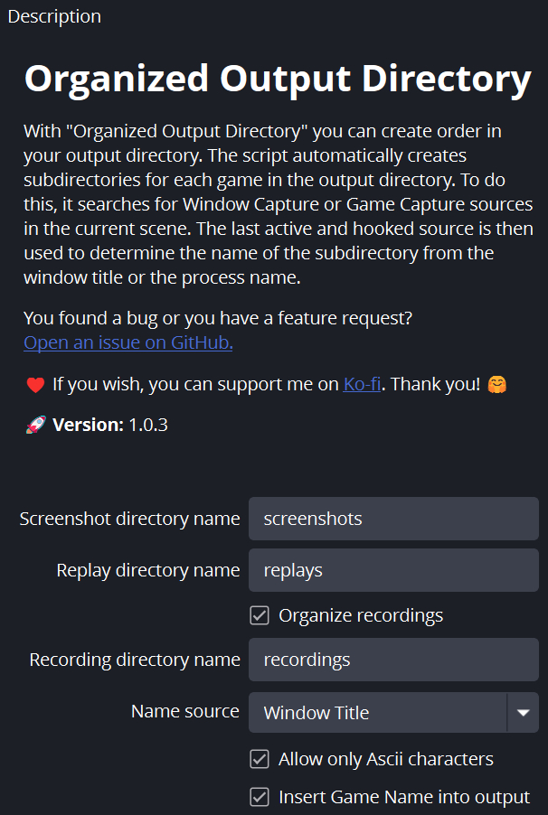
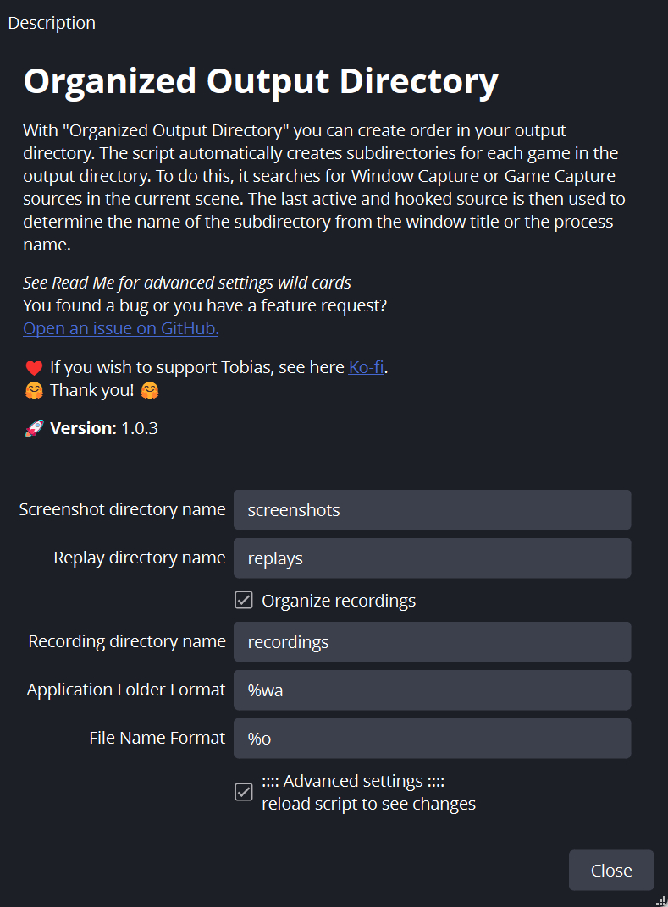

# Organized Output Directory

With "Organized Output Directory" you can create order in your output directory.
The script automatically creates subdirectories for each game in the output directory.
To do this, it searches for Window Capture or Game Capture sources in the current scene.
The last active and hooked source is then used to determine the name of the subdirectory from the window title or the process name.

*See below for advance settings wildcards*

# 📋 Requirements
* Windows 10/11
* OBS 29.0.0

---
<br>

<!-- {width=300px height=200px} -->


# 🏗️ Known Issues / Planned Features

- Some kind of rule/wildcard/match system would be useful.<p>
  Some games/apps like Minecraft are a little tricky. The window title contains the current game version like `Minecraft 1.20.4` and the process name is something like `javaw.exe`. With a rule/wildcard/match system, we could change the name and remove the version from the window title, for example.

- Currently only Windows is supported. I would like to get the script running on Linux and MacOS as well. *Currently MacOS does not have an application or window capture functionality in OBS. Linux has not been tested.*


# 👑 Credits
**🧑‍💻 Author:** Tobias Lorenz [GitHub](https://github.com/MrMartin92) [Twitch](https://twitch.tv/MrMartin_)<br>
**🧑‍💻 Contributor:** Aaron Shackelford [GitHub](https://github.com/chessset5?tab=repositories) [Twitch](https://www.twitch.tv/chessset5)<br>
**🔬 Source:** [GitHub.com](https://github.com/MrMartin92/obs_organized_output_directory)<br>
**🧾 Licence:** [MIT](https://raw.githubusercontent.com/MrMartin92/obs_organized_output_directory/main/LICENSE)<br>


# 🕶️ Advanced Settings
As of writing there is not reload script description nor reload script call for Lua in the OBS API, so you will be required to reload the script if you enable the advanced settings.<br> *Click the button boxed in red below to reload the script:*




This version of the script allows for the following wild cards
on the **moved OBS output file** and **application folder name**

```
WINDOW_TITLE = "%w"
WINDOW_TITLE_ASCII = "%wa"
EXECUTABLE = "%e"
EXECUTABLE_ASCII = "%ea"
ORIGINAL_FILE_NAME = "%o"
```

Layout:
```
📁 Custom Folder Name
├── 📁 Screenshots Folder
│   └── 🖼️ Custom Screenshot Name.png
├── 📁 Replays Folder
│   ├── 🎥 Custom Replay Name.mkv
│   └── 🎥 Custom Replay Name.mp4
└── 📁 Recordings Folder
    ├── 🎥 Custom Recording Name.mkv
    └── 🎥 Custom Recording Name.mp4
```
Example:

```
Screenshots directory name: Screen Shots
    Replays directory name: Replays
  Recording directory name: Recordings
 Application Folder Format: %wa [%ea]
          File Name Format: [%wa] %o
-----------------------------------------
📁 Video Game 6 [VG6.exe]
├── 📁 Screen Shots
│   └── 🖼️ [Video Game 6] OBS Screenshot.png
│   └── 🖼️ [Video Game 6] OBS Screenshot(1).png
├── 📁 Replays
│   ├── 🎥 [Video Game 6] Replay OBS output.mkv
│   ├── 🎥 [Video Game 6] Replay OBS output(1).mkv
│   └── 🎥 [Video Game 6] Replay OBS output.mp4
└── 📁 Recordings
    ├── 🎥 [Video Game 6] OBS output.mkv
    └── 🎥 [Video Game 6] OBS output.mp4
    └── 🎥 [Video Game 6] OBS output(1).mp4
```